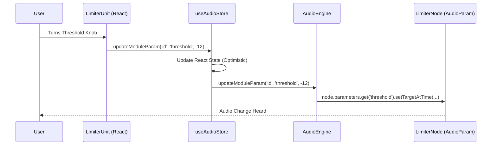
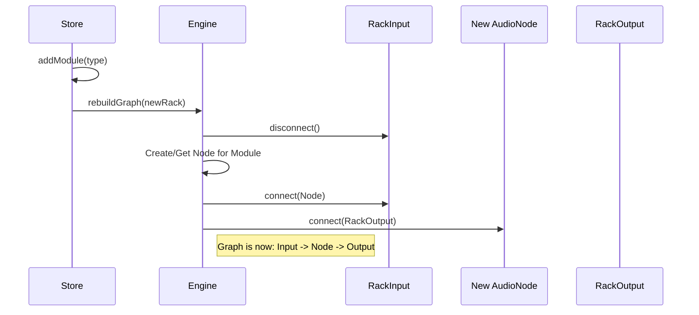
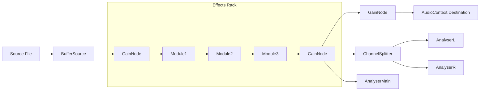

# Architecture & Flow

SonicForge follows a strict **unidirectional data flow** where the UI triggers state updates, which then propagate to the Audio Engine. The UI never talks to the Audio Engine directly; it goes through the Store.

## Directory Map

```
src/
├── audio/               # The "Sound" Layer
│   ├── context.ts       # AudioEngine Singleton (The Graph Manager)
│   └── worklets/        # DSP Logic (Processors + Nodes)
├── components/          # The "View" Layer
│   ├── rack/            # Effect Modules (UI)
│   ├── ui/              # Reusable atoms (Knobs, Shells)
│   └── visualizers/     # Canvas-based Analyzers
├── store/               # The "Brain" Layer
│   └── useAudioStore.ts # Zustand Store
└── hooks/               # Logic Hooks (Persistence, etc.)
```

## Critical Flows

### 1. The "Trinity" Update Flow

When a user turns a knob, the following chain reaction occurs:



### 2. Audio Graph Reconstruction (Adding a Module)

Adding a module requires rebuilding the Web Audio graph to insert the new node into the chain.



### 3. Audio Signal Path

The internal routing of the `AudioEngine`.


