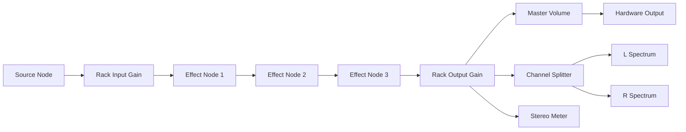

# The Audio Graph & Engine Architecture

## 1. Introduction
The `AudioEngine` class is the mechanical heart of Sonic Forge. It is a Singleton service responsible for translating the declarative state of the application into a functional, imperative Web Audio API graph.

Managing a Web Audio graph is complex. Nodes cannot be "moved"; they must be disconnected and reconnected. Connections must be made in a specific order to avoid feedback loops or silence. The `AudioEngine` abstracts this complexity, providing a clean API to the rest of the app.

---

## 2. Core Responsibilities

1.  **Context Management:** Initializing the `AudioContext` and handling browser autoplay policies (waiting for user interaction).
2.  **Resource Loading:** Fetching and compiling `AudioWorklet` modules (DSP scripts) from the network.
3.  **Graph Topology:** Constructing the signal chain based on the user's "Rack" configuration.
4.  **Parameter Relay:** Forwarding automation data from the UI to the correct `AudioParam`.
5.  **Offline Rendering:** Managing the separate `OfflineAudioContext` for bouncing projects to WAV.

---

## 3. The Signal Chain
The routing architecture is designed for a stereo mastering workflow.

### 3.1 The "Gapless" Rebuild Strategy
A naive implementation would tear down the entire graph and rebuild it every time a module is added or moved. This causes audible glitches and CPU spikes.
Sonic Forge implements a **Partial Rebuild / Diffing Strategy**:

1.  **State Comparison:** When `rebuildGraph(newRack)` is called, the engine compares `newRack` with `currentRack`.
2.  **Node Reuse:** It identifies modules that exist in both lists (by ID). These `AudioNode` instances are preserved, maintaining their internal state (e.g., delay buffers, filter memory).
3.  **Topology Update:**
    - New modules are instantiated.
    - Deleted modules are disconnected and garbage collected.
    - Connections are re-routed only where the chain order has changed.
    - If Module A and Module B are still adjacent, their connection is left untouched.

### 3.2 Analysis Routing
The engine maintains permanent Analysis Nodes (`AnalyserNode`) connected to the output of the Rack.
- **Main Analyser:** Stereo FFT for the Master Visualizer.
- **L/R Analysers:** Used for Goniometers (Phase Correlation) and stereo balance metering.
- These are *never* disconnected, ensuring visualizers stay active even during graph operations.

---

## 4. The AudioEngine Class Structure

### 4.1 Initialization (`init()`)
This method is asynchronous and idempotent.
1.  Checks if `AudioContext` exists.
2.  Calls `context.audioWorklet.addModule()` for every processor file.
3.  Sets up the master gain and analysis nodes.
4.  Sets the `isInitialized` flag.

### 4.2 Module Creation (`createModuleNode()`)
A factory method that switches on the module type string (`'LIMITER'`, `'COMPRESSOR'`) and instantiates the specific `AudioWorkletNode` subclass (e.g., `new LimiterNode(context)`).

### 4.3 Parameter Updates (`updateModuleParam()`)
1.  Look up the node in `nodeMap` using the module ID.
2.  Call `node.setParam(key, value)`.
3.  The Node class handles the `setTargetAtTime` smoothing logic.

---

## 5. Offline Rendering (Bouncing)
The export process uses the `OfflineAudioContext`, which renders audio as fast as the CPU allows (often 10-50x real-time).

1.  **Clone State:** The engine takes a snapshot of the current Rack state.
2.  **Spawn Context:** Creates a new `OfflineAudioContext` with the length of the source file.
3.  **Mirror Graph:** Re-instantiates the entire graph within this new context.
    - *Note:* We cannot reuse the live nodes because they are bound to the live `AudioContext`. New instances must be created.
4.  **Copy Parameters:** Iterates through the live parameter values and applies them to the offline nodes.
5.  **Render:** Calls `startRendering()`.
6.  **Encode:** Receives the resulting `AudioBuffer`, encodes it to WAV (interleaved), and triggers a browser download.

---

## 6. Performance Considerations
- **Garbage Collection:** By reusing nodes, we minimize object churn. However, frequent graph changes can still pressure the GC.
- **Worklet Loading:** Loading worklets involves network requests (even for local files). We cache the loaded state to prevent re-fetching.
- **Node Map:** We use a `Map<string, AudioNode>` for O(1) lookups of nodes by ID, ensuring parameter updates remain instantaneous even with 100+ modules.
